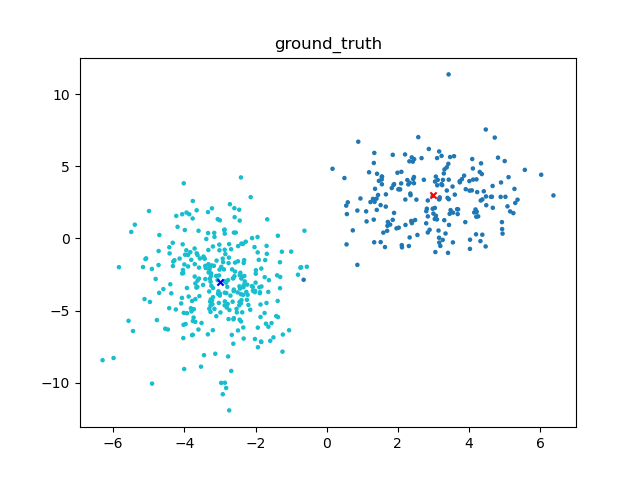

# EM
*Project for CS5339*
python implementation of Expectation Maximization Algorithm  
## Update parameters
```
ground truth:mu_1:(-3.00, -3.00), mu_2:(3.00, 3.00), var_1:(1.00, 8.00), var_2:(2.00, 4.50), lambda:(0.6, 0.4)
iteration:1.00, update:17.24, mu_1:(1.00, 1.00), mu_2:(5.00, 5.00), var_1:(1.00, 1.00), var_2:(1.00, 1.00), lambda:(0.70, 0.30)
iteration:2.00, update:2.41, mu_1:(-1.00, -1.00), mu_2:(3.00, 4.00), var_1:(6.00, 11.00), var_2:(1.00, 2.00), lambda:(0.81, 0.19)
iteration:3.00, update:3.41, mu_1:(-1.00, -1.00), mu_2:(3.00, 3.00), var_1:(5.00, 10.00), var_2:(1.00, 2.00), lambda:(0.73, 0.27)
iteration:4.00, update:3.24, mu_1:(-2.00, -2.00), mu_2:(3.00, 3.00), var_1:(3.00, 10.00), var_2:(1.00, 2.00), lambda:(0.66, 0.34)
iteration:5.00, update:0.00, mu_1:(-2.00, -2.00), mu_2:(3.00, 3.00), var_1:(1.00, 9.00), var_2:(1.00, 3.00), lambda:(0.62, 0.38)
```
## Result

<p float="left">
  
  
</p>

## reference:
> matlab code https://github.com/rezaahmadzadeh/Expectation-Maximization
